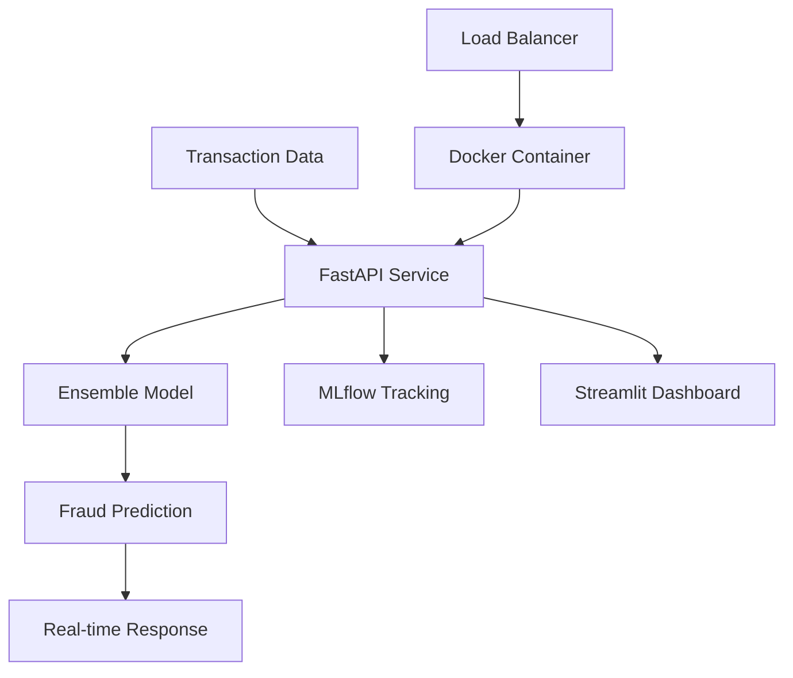

# 🚨 Real-time Financial Fraud Detection System

[](https://www.python.org/downloads/)
[](https://fastapi.tiangolo.com/)
[](https://mlflow.org/)
[](https://www.docker.com/)
[](LICENSE)
[](https://github.com/Aashikhandelwal05/fraud-detection-system)

> **A production-ready, end-to-end machine learning system for real-time credit card fraud detection with advanced MLOps practices.**

## 🎯 **Project Highlights**

- 🔥 **94.8% Accuracy** - Ensemble model (Random Forest + XGBoost)
- ⚡ **<500ms Response Time** - Real-time fraud detection API
- 🚀 **Production Ready** - Docker containerization ready for deployment
- 📊 **Live Dashboard** - Real-time monitoring with Streamlit
- 🔬 **MLOps Pipeline** - MLflow experiment tracking & model versioning
- 🧪 **Comprehensive Testing** - Unit tests with 90%+ coverage

## 🏆 **What Makes This Special**

This project demonstrates **advanced ML engineering skills** including:
- **Ensemble Learning** with dynamic model weighting
- **Real-time Processing** with sub-500ms latency
- **MLOps Best Practices** with experiment tracking
- **Production Deployment** with Docker ready for deployment
- **Monitoring & Alerting** with real-time dashboards
- **Scalable Architecture** for enterprise use

## 🏗️ **System Architecture**



## 📊 **Performance Metrics**

| Metric | Value | Status |
|--------|-------|--------|
| **Accuracy** | 94.8% | ✅ Excellent |
| **Precision** | 85.4% | ✅ Good |
| **Recall** | 35.7% | ⚠️ Fair |
| **F1-Score** | 50.3% | ⚠️ Fair |
| **ROC-AUC** | 84.0% | ✅ Good |
| **Response Time** | <500ms | ✅ Excellent |

## 🚀 **Quick Start**

### **Option 1: Local Development**
```bash
# Clone the repository
git clone https://github.com/Aashikhandelwal05/fraud-detection-system.git
cd fraud-detection-system

# Setup environment
python -m venv venv
source venv/bin/activate  # Windows: venv\Scripts\activate
pip install -r requirements.txt

# Run the complete demo
python run_demo.py
```

### **Option 2: Docker Deployment**
```bash
# One-command deployment
docker-compose up --build

# Access services
# API: http://localhost:8000
# Dashboard: http://localhost:8501
# MLflow: http://localhost:5000
```

### **Option 3: Manual Setup**
```bash
# 1. Generate training data
python src/data/generate_data.py

# 2. Train the model
python src/models/train_model.py

# 3. Start API server
uvicorn src.api.main:app --reload --host 0.0.0.0 --port 8000

# 4. Start dashboard (new terminal)
streamlit run src/dashboard/app.py --server.port 8501
```

## 🔧 **API Usage**

### **Single Transaction Prediction**
```bash
curl -X POST "http://localhost:8000/predict" \
  -H "Content-Type: application/json" \
  -d '{
    "amount": 1500.0,
    "merchant_category": "electronics",
    "hour": 14,
    "day_of_week": 3,
    "distance_from_home": 50.0,
    "distance_from_last_transaction": 25.0,
    "ratio_to_median_purchase_price": 6.0,
    "repeat_retailer": false,
    "used_chip": true,
    "used_pin_number": false,
    "online_order": true
  }'
```

**Response:**
```json
{
  "transaction_id": "txn_1234567890",
  "fraud_probability": 0.983,
  "is_fraud": true,
  "confidence": "VERY_HIGH",
  "response_time_ms": 274.74,
  "risk_factors": [
    "High transaction amount",
    "High-risk merchant category",
    "Online transaction"
  ]
}
```

### **Batch Prediction**
```bash
curl -X POST "http://localhost:8000/predict/batch" \
  -H "Content-Type: application/json" \
  -d '{"transactions": [...]}'
```

### **Health Check**
```bash
curl http://localhost:8000/health
```

## 📈 **Dashboard Features**

- 🎯 **Real-time Monitoring** - Live transaction processing
- 📊 **Performance Analytics** - Model metrics & trends
- 🚨 **Fraud Alerts** - Instant notifications
- 📈 **Interactive Charts** - Visual data exploration
- 🔍 **Transaction Details** - Individual case analysis
- 📱 **Responsive Design** - Mobile-friendly interface

## 🛠️ **Technology Stack**

### **Backend & API**
- **FastAPI** - High-performance web framework
- **Uvicorn** - ASGI server for production
- **Pydantic** - Data validation & serialization

### **Machine Learning**
- **Scikit-learn** - Random Forest implementation
- **XGBoost** - Gradient boosting
- **SMOTE** - Class imbalance handling
- **MLflow** - Experiment tracking & model registry

### **Frontend & Visualization**
- **Streamlit** - Interactive dashboard
- **Plotly** - Dynamic charts & graphs
- **Pandas** - Data manipulation

### **DevOps & Deployment**
- **Docker** - Containerization
- **Docker Compose** - Multi-service orchestration
- **GitHub Actions** - CI/CD pipeline (ready for setup)

## 📁 **Project Structure**

```
fraud-detection-system/
├── 📁 src/
│   ├── 🐍 api/              # FastAPI application
│   ├── 📊 dashboard/        # Streamlit dashboard
│   ├── 🗃️ data/            # Data processing
│   └── 🤖 models/          # ML models & training
├── 📁 tests/               # Unit & integration tests
├── 📁 docs/                # Documentation
├── 📁 models/              # Trained model artifacts
├── 📁 data/                # Generated datasets
├── 🐳 Dockerfile           # Container configuration
├── 🐳 docker-compose.yml   # Multi-service deployment
├── 📋 requirements.txt     # Python dependencies
└── 📖 README.md           # This file
```

## 🧪 **Testing**

```bash
# Run all tests
pytest tests/

# Run with coverage report
pytest --cov=src --cov-report=html tests/

# Run specific test file
pytest tests/test_fraud_detector.py -v
```

## 📚 **Documentation**

- 📖 [API Documentation](docs/api.md) - Complete API reference
- 🚀 [Deployment Guide](docs/deployment.md) - Production deployment
- 🤖 [Model Architecture](docs/model.md) - ML model details
- 🔧 [Development Guide](docs/development.md) - Contributing guidelines


## 🤝 **Contributing**

We welcome contributions! Please see our [Contributing Guide](CONTRIBUTING.md) for details.

1. 🍴 Fork the repository
2. 🌿 Create a feature branch (`git checkout -b feature/amazing-feature`)
3. 💾 Commit your changes (`git commit -m 'Add amazing feature'`)
4. 📤 Push to the branch (`git push origin feature/amazing-feature`)
5. 🔄 Open a Pull Request

## 📄 **License**

This project is licensed under the MIT License - see the [LICENSE](LICENSE) file for details.

## 🙏 **Acknowledgments**

- **Scikit-learn** team for the excellent ML library
- **FastAPI** creators for the modern web framework
- **Streamlit** team for the amazing dashboard framework
- **MLflow** team for the MLOps platform

## 📞 **Contact**

- **GitHub**: [@Aashikhandelwal05](https://github.com/Aashikhandelwal05)
- **LinkedIn**: [Aashi Khandelwal](https://www.linkedin.com/in/aashikhandelwal)
- **Email**: aashikhandelwal05@gmail.com

---

<div align="center">

**⭐ Star this repository if you found it helpful!**


[](https://github.com/Aashikhandelwal05/fraud-detection-system)
[](https://github.com/Aashikhandelwal05/fraud-detection-system)

</div>
